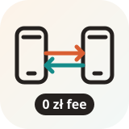

<p align="center">
  
</p>

<h1 align="center">BLIK Phone Payments for Go</h1>

<p align="center">
  Zero-fee phone-to-phone payments, reconciled from bank notification emails.
</p>

<p align="center">
  <a href="https://github.com/mleczakm/blik-phone-payments-go/actions/workflows/ci.yml"></a>
</p>

`blik-phone-payments-go` provides Go helpers for matching incoming BLIK phone-to-phone payments to orders. Customers send the payment from their banking app; this library does not handle funds or call a payment gateway.

## How it works

1. The application creates a short payment title code and shows the recipient's BLIK phone number.
2. The customer sends a phone-to-phone BLIK payment and includes the code in the title.
3. The bank sends an incoming payment notification **by email** to a configured mailbox.
4. The mailbox reader fetches unseen emails over IMAP. A bank parser extracts payment details, and the matcher finds the code in the email's transfer title.

There is no payment operator in this flow, and the library adds no transaction fee. Bank account fees and notification-email setup remain outside the library.

## Package features

- Generate and validate four-character payment codes.
- Parse amounts into grosz without floating-point rounding.
- Parse supported Alior and generic bank notification emails.
- Match codes in transfer titles, including codes split across adjacent words, common `I`/`1` and `O`/`0` substitutions, and BLIK phone-number boilerplate.
- Read unseen bank notification emails over IMAP and mark only accepted messages as seen.

## Install

```sh
go get github.com/mleczakm/blik-phone-payments-go
```

```go
import blikpayments "github.com/mleczakm/blik-phone-payments-go"

code, err := blikpayments.GenerateCode()
if err != nil {
	return err
}

matchedCode := blikpayments.FindCode(notification.Title, pendingCodes)
```

Application-specific persistence, order workflows, and customer notifications stay in the consuming application.
